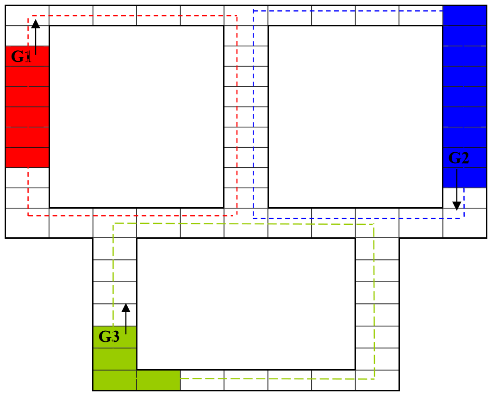

# PW-17/2018
Język implementacji: *Java*  
Środowisko implementacyjne: *Eclipse*, *IntelliJ IDEA*, *NetBeans*  
Termin wykonania: *ostatnie zajęcia projektowe*  

## Podstawowe wymagania
- liczba procesów sekwencyjnych powinna być dobrana z wyczuciem tak, aby zachować czytelność interfejsu i jednocześnie umożliwić zobrazowanie reprezentatywnych przykładów;
- kod źródłowy programu musi być tak skonstruowany, aby można było "swobodnie" modyfikować liczbę procesów sekwencyjnych (za wyjątkiem zadań o ściśle określonej liczbie procesów);
- obok poprawnej identyfikacji sekcji krytycznych program musi brać pod uwagę czytelność i estetykę interfejsu użytkownika oraz zdolność percepcji osoby oceniającej;
- działanie programu powinno być zobrazowane w sposób graficzny (elementy animacji).

## Problem do rozwiązania - gąsienice
- na planszy porusza się N gąsienic o ustalonych długościach;
- gąsienice poruszają się z różnymi prędkościami;
- należy zapewnić, że gąsienice nigdy nie będą ze sobą kolidowały;
- plansza ma zadane wymiary zgodnie z rysunkiem;
- fakt wstrzymywania gąsienicy należy zobrazować;
- kierunek poruszania się gąsienicy jest ustalony.

